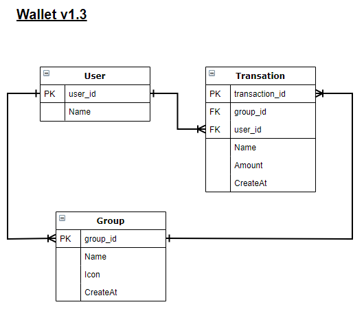

# WalletGroup
> A app where you can manager your personal cash flow


<br>The main point on this project is to deploy a working app, starting from stratch, in less than 5 days.<br>

## Content

* [Features](#features)
* [Built With](#built-with)
* [Database Diagram](#database-diagram)
* [Getting Start](#getting-start)
* [Contributing](#contributing)
* [Acknowledgments](#acknowledgments)
* [Author](#author)
* [License](#license)

## Business requirements

<p>Use same design pattern in all pages</li>

<ul>
  <p>0 - As a guest your can: </p>
  <li>Create account and make login</li>
  <li>Authenticate with username only</li>
</ul>

<ul>
  <p>1 - As a logged-in user: </p>
  <li>See user profile and this is the main page</li>
</ul>
<ul>
  <p>2 - Navigation menu with:<p>
  <li>All my transactions</li>
  <li>All my external transactions</li>
  <li>All groups</li>
</ul>
<ul>
  <p>3 - All transactions list page:</p>
  <li>Total amount (Balance)</li>
  <li>A ordered transactions list</li>
  <li>Each line displays its name, amount and date, with an icon from group</li>
  <li>Button to add transactions</li>
</ul>
<ul>
  <p>4 - External transactions list page:</p>
  <li>Show all transactions created but not assigned to groups (sorted by most recent).</li>
  <li>Similar layout as transactions list</li>
</ul>
<ul>
  <p>5 - Groups transactions page:</p>
  <li>List all categories by alphabetical order</li>
  <li>Each line display a icon, name and creation date</li>
  <li>Button to create new category</li>
  <li>Similar layout as profile</li>
</ul>
<ul>
  <p>6 - Group transactions page:</p>
  <li>See all related transations</li>
  <li>Similar layout as transactions list</li>
  <li>Plus show name of who made the transation</li>
</ul>
<ul>
  <p>7 - Create new...</p>
  <li>user, group or transation has the properly form with styles</li>
</ul>
<ul>
  <p>7 - Extra feature</p>
  <li>Can see the balance based on transations expend x earned</li>
</ul>

## Built With

- Ruby 2.7 <br>
- Ruby on Rails 5.2 <br>
- Postgres and Devise gem (AOT)
- Rubocop (Linter) with Stickler (CI Tool) <br>
- Git, Github and VScode <br>

## Database Diagram



## Getting Start

#### Install
To use this program, you will need install:
* Ruby Language - Version 2.6 - [Install guide](https://www.ruby-lang.org/en/documentation/installation/)

* Ruby on Rails - Version 5.2 - [Install guide](https://guides.rubyonrails.org/v5.0/getting_started.html#installing-rails)


#### Get a local copy
Now you need a copy of this application, if you are using Git:
```js
git clone git@github.com:SevlaMare/wallet.git
```
Otherwise just hit (Download Zip) on green button (Clone or Download) at top of this page.


#### Setup

Instal all dependencies with:

```
bundle install
```

Setup database with:

```
rake db:schema:load
```

#### Run App
To run, from the application folder, just type on terminal:
```js
rails server
```
Now you can go to your favorite web browser like Google Crome and access the url
<br> http://localhost:3000


#### Test (Remove before merge!)
On terminal type:
```
rake db:test:load
```
It will create database for testing, to run the tests:
```
rspec
```

### Contributing

Contributions, issues and feature requests are welcome!

You can do it on [issues page](issues/).

## Acknowledgments

A special thanks for the code reviewers.

## Author

👤 **Thiago Miranda**

- Github: [@SevlaMare](https://github.com/SevlaMare)
- Twitter: [#SevlaMare](https://twitter.com/SevlaMare)
- Linkedin: [SevlaMare](https://www.linkedin.com/in/sevla-mare)

### License
Design idea by [Gregoire Vella](https://www.behance.net/gregoirevella) on Behance.
<br>
<strong>Creative Commons • June 2020</strong>
